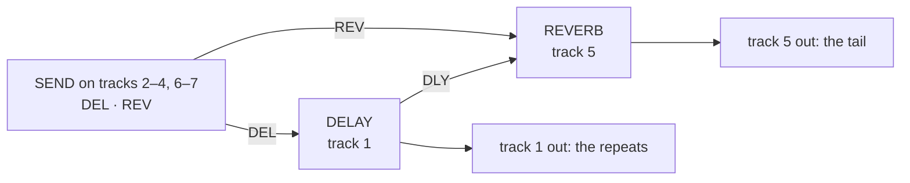

# bottleservice

A remix of Octatrack OS 1.40C, built from your own copy of it, that adds:

- a **delay and reverb bus** with a send from every track, and three new
  FX1 effects (a filter, a drive pedal and a modulation pedal);
- **scene locks on page 2** and a TEMPO window that edits the bus engines;
- **USB MIDI** and **USB audio** (the master track into a computer) over
  the Octatrack's own USB port;
- Em's **Octakit**: 256 Kits per project instead of 64 bank-tied Parts.

Named after the set it is built for. Runs on an MKII; see [Where it has
run](#where-it-has-run). Each module has its own page with the technical
detail; this page says what you get and how to put it on the unit.

## The effects

### The bus

Every track's FX2 slot takes part in one delay-and-reverb chain. Tracks 1
and 5 host the two engines; every other track has a SEND with two knobs,
DEL and REV, that set how much of the track goes to each. The delay's
repeats also feed the reverb (the reverb's DLY knob). Each engine's wet
signal comes out on the track that hosts it.



| track | FX2 | knobs |
|---|---|---|
| 1 | **DELAY** (locked) | page 1: DEL · REV · FDBK · TONE · PING · WET; page 2: MODE · SCTR · DENS · SIZE · PTCH · TIME |
| 5 | **REVERB** (locked) | page 1: DEL · REV · SIZE · SHMR · SHFT · WET; page 2: MODE · TONE · DIFF · GATE · DLY · TIME |
| 2–4, 6–7 | **SEND** | DEL · REV |
| 8 (master) | stock **DELAY** | stock's, for its beat repeat |

- **DELAY** modes: CLEAN, GRAIN (a pitched granular cloud over the delay
  lines) and REVERSE, with tape wow on the loop in every mode. Up to 739 ms.
  TIME is a free dial that snaps to tempo divisions (1/32T to 1/4.) and
  shows the division name while it holds one. Module: [`busdelay`](../../modules/busdelay/README.md).
- **REVERB** modes: ROOM, PLATE, BIG, with a shimmer (SHMR, SHFT), a gate
  and a tone control. Module: [`busverb`](../../modules/busverb/README.md).
- **SEND** at DEL 0 and REV 0 is the same as no effect. Every level knob
  is auto-gained so eight senders drive an engine as hard as one.
  Module: [`send`](../../modules/send/README.md).
- A new project is born wired this way ([`rig-hosts`](../../modules/rig-hosts/README.md));
  the engines are hidden from the FX2 chooser and locked to their tracks.
  An older project keeps its stored ids until you run the `host` command
  below.

### Three FX1 stations

These sit in the FX1 chooser in place of stock's FILTER, LO-FI and CHORUS.
The other stock FX1 effects are still there. At their default knobs all
three pass audio through unchanged.

| station | in place of | modes | page 1 | page 2 |
|---|---|---|---|---|
| **SPECTRUM** | FILTER | LADR (Moog ladder) · SEM (Oberheim SVF, SHPE sweeps LP → BP → HP) · ISO · VOWL | FREQ · RES · ENV · LDP · LSP · WDTH | MODE · SHPE |
| **CHARACTER** | LO-FI | SAT: TAPE · TUBE · INFL | DRV · FOLD · WDTH · COMP · TONE · MIX | SAT |
| **MODULATION** | CHORUS | JUNO · DIM · FLNG · COMB · PHSR | RATE · DPTH · DLY · FDBK · LOFI · MIX | MODE · TONE · WDTH |

Modules: [`spectrum`](../../modules/spectrum/README.md),
[`character`](../../modules/character/README.md),
[`modulation`](../../modules/modulation/README.md).

### Knobs that follow a mode

Turning a MODE knob re-defaults the knobs around it to that mode's
starting values, on the panel and over MIDI
([`mode-defaults`](../../modules/mode-defaults/README.md)).

## Scenes, tempo and MIDI

- **Scene locks on page 2.** Hold a scene and turn a page-2 knob on FX1 or
  FX2 to lock it; FUNC + turn removes the lock. The crossfader morphs
  locked page-2 knobs as it does page 1 (a select snaps at the midpoint).
  Locks travel with the Part or Kit through copy, paste, clear and undo.
  ([`scenes-p2`](../../modules/scenes-p2/README.md))
- **The TEMPO window edits the bus.** [TEMPO] opens two boxes, DELAY and
  REVERB, listing each engine's knobs. UP / DOWN pick a row, A or B edit
  it, LEFT / RIGHT switch box. LEVEL still sets the BPM; FUNC + LEVEL in
  0.1 steps. ([`tempo-bus`](../../modules/tempo-bus/README.md))
- **MIDI CC onto page 2.** Stock reaches page 1 only. CC 62–67 set FX2
  page 2 and CC 68–73 set FX1 page 2 on every track whose channel matches.
  Needs AUDIO CC IN on in the project.
  ([`cc-map`](../../modules/cc-map/README.md))
- **Knob values out as CC.** Every knob value that changes -- a pattern or
  part change, a project load, a MODE re-default, an incoming CC, a
  page-2 turn -- is transmitted as its CC on the track's channel (page 1 as
  CC 16-45, page 2 as the numbers above), so a controller's encoders show
  the unit's state. Stock sends page-1 panel turns only. Needs AUDIO CC
  OUT set to EXT or INT+EXT. Port only.
  ([`cc-feedback`](../../modules/cc-feedback/README.md))
- **Delay in time.** The delay reads the project tempo and follows tempo
  changes while TIME sits on a division.
  ([`tempo-sync`](../../modules/tempo-sync/README.md))

## USB

Plug the unit into a computer over its USB port.

- **USB MIDI**, in and out, mirroring the DIN ports. macOS lists it as
  "Elektron Octatrack DPS-1". OS upgrades still go over DIN or the card,
  not USB. ([`usb-midi`](../../modules/usb-midi/README.md), markandrus)
- **USB audio: the master track.** A two-channel 44.1 kHz 24-bit input on
  the computer carrying track 8 left and right, after T8's effects and
  before T8's LEVEL and the MAIN volume. With MASTER TRACK on, that is the
  whole mix. ([`usb-audio-master`](../../modules/usb-audio-master/README.md))

  ```bash
  sox -t coreaudio "Elektron Octatrack DPS-1" -c 2 -r 44100 -b 24 take.wav trim 0 60
  ```

## Kits

Em's Octakit replaces the 64 bank-tied Parts with 256 named Kits per
project. Any Kit loads on any pattern. Her README is the manual:
[emuyia/ems-octakit](https://github.com/emuyia/ems-octakit). The short
version, MKII keys:

| do | press |
|---|---|
| load / save a Kit | PART / FUNC + PART |
| reload the saved Kit | FUNC + CUE |
| undo the last Kit load | LOAD KIT → UNDO KIT |
| save a pasted pattern's Kit to the next free slot | FUNC + PASTE + PART |
| save the Kit, copy it and the pattern to the next free slots, load the pair | PTN + FUNC + RIGHT |

Old projects are migrated from Parts to Kits the first time they load.
Module: [`octakit`](../../modules/octakit/README.md); the two bridge modules
that let Octakit, CC MAP and the scene locks share the same hooks are
[`scenes-kits`](../../modules/scenes-kits/README.md) and
[`scenes-p2-kits`](../../modules/scenes-p2-kits/README.md).

## What it costs

| | stock | bottleservice |
|---|---|---|
| sample and recorder memory | 14,602 pages | 12,367 pages (Octakit's Kit store and the USB buffers take the rest) |
| DSP time per core | | worst case priced at 2,581 of 3,120 cycles: four MODULATION on tracks 5–8 beside the reverb |

On image 88 a fourth MODULATION beside the reverb overran the DSP and
three fit; the cycle pass that followed prices four inside the budget and
has not been measured on the unit.

## Where it has run

- **Hardware:** Sam's MKII, image 88 (built from main `d6867bd`, 27 Sep
  2026). Load, play, TEMPO window, Kit save and reload, USB audio and a
  page-2 scene lock are the things to try on it; which of them have been
  tried is not written down yet.
- **Under the ColdFire emulator:** `make check REMIX=bottleservice` with a
  real project, every gate green; Kit save, FUNC + CUE reload, cross-Kit
  load and LOAD KIT copy/paste keep values written by MODE DEFAULTS and CC
  MAP. The SCENES P2 + Octakit page-2 turn, which halted until 28 Sep 2026,
  runs whole.
- **Not measured anywhere:** Octakit's unsaved-changes marking after a MODE
  or CC write; UNDO KIT and pattern paste after one; whether `host` and
  `stamp-defaults` survive the Parts → Kits migration.

## How to flash

1. **Set up once.** Clone the repository and fetch the stock OS:
   [BUILDING.md](../../docs/remixes/BUILDING.md) §1–2 (`make setup`,
   `make os`, `make recon`). You need an MKI or MKII on 1.40C and its CF
   card.
2. **Build the image.** Pick a build number; it becomes the OS version the
   unit shows and the suffix on every octabam effect's name. Bump it each
   time you flash.

   ```bash
   make image REMIX=bottleservice BUILD=91
   ```

   The card image is `out/OCTATRACK_OCTABAM91.bin`. Optional:
   `make emu-cf` then `make check REMIX=bottleservice` runs every gate and
   boots the image in the emulator first (about half an hour).
3. **Back up the card.** USB DISK MODE, copy everything. Octakit migrates
   Parts into Kits on load and going back to stock can lose Kit data.
4. **Old projects.** For a project made before this remix, on the card:

   ```bash
   python3 tools/hw/ot_project.py host "<card>/<set>/<project>"
   python3 tools/hw/ot_project.py stamp-defaults "<card>/<set>/<project>" bottleservice
   ```

   `host` wires the delay to track 1, the reverb to track 5 and SEND
   elsewhere; `stamp-defaults` writes the remix's knob defaults where the
   stored bytes mean something else now. A project made on the unit after
   the flash needs neither.
5. **Flash from the card.** On the unit: PROJECT → SYSTEM → USB DISK MODE →
   YES. Copy the `.bin` to the root of the card, eject it on the computer,
   leave USB DISK MODE. Then PROJECT → SYSTEM → OS UPGRADE → YES. When it
   restarts, **power-cycle it once more**: an OS upgrade does not clear DSP
   RAM and the first boot has played garbled audio that a reboot cleared.
   SYSTEM STATUS → OS VERSION reads `OCTABAM91`.
6. **Back to stock.** Power off, hold FUNC and power on → STARTUP MENU →
   TRIG 3 → MIDI UPGRADE, then send `downloads/extracted/OCTATRACK_OS1.40C.syx`
   over DIN MIDI from a SysEx app. Do not power off during UPDATING FLASH.
   Details and recovery: [BUILDING.md](../../docs/remixes/BUILDING.md) §5–6.

If the unit misbehaves, [FAILURE_MODES.md](../../docs/remixer/FAILURE_MODES.md)
is the register of what has gone wrong and why.
